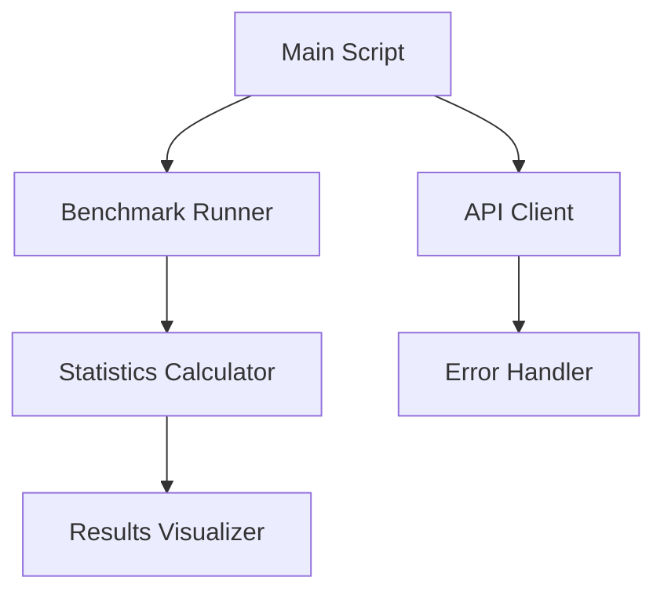

# LLM Benchmark Script Plan

## Requirements Summary

- **Python Version**: 3.11
- **Endpoint**: OpenAI-compatible API (default: https://litellm.ai-sandbox.azure.to2cz.cz)
- **Authentication**: API key "sk-xxx"
- **Dependency Management**: uv
- **Metrics Focus**: Latency (response time) with statistical analysis
- **Test Configuration**: 10 requests with a simple prompt
- **Results Format**: Console output with statistics and ASCII histogram
- **Configuration**: Simple with defaults in code

## System Architecture



## Component Breakdown

### 1. API Client
- Handles communication with the OpenAI-compatible endpoint
- Manages authentication and request formatting
- Implements retry logic and timeout handling

### 2. Benchmark Runner
- Executes the specified number of requests
- Measures and records response times
- Collects raw data for analysis

### 3. Statistics Calculator
- Processes raw timing data
- Calculates key statistics:
  - Mean
  - Median
  - Standard deviation
  - Percentiles (90th, 95th, 99th)
  - Min/Max values

### 4. Results Visualizer
- Formats and displays statistics in the console
- Generates ASCII histogram for latency distribution
- Presents summary of benchmark results

### 5. Error Handler
- Manages API errors and exceptions
- Provides meaningful error messages
- Ensures graceful failure and reporting

## Implementation Plan

### Step 1: Project Setup
- Update `pyproject.toml` to include required dependencies:
  - `httpx` for HTTP requests
  - `statistics` from standard library for statistical calculations
  - `argparse` from standard library for minimal command-line options

### Step 2: Implement API Client
- Create functions to handle API communication
- Implement proper error handling and retries
- Set up authentication with the provided API key

### Step 3: Develop Benchmark Runner
- Create the core benchmarking logic
- Implement timing measurements for requests
- Store results for analysis

### Step 4: Build Statistics Calculator
- Implement functions to calculate statistical measures
- Process the raw timing data

### Step 5: Create Results Visualizer
- Develop console output formatting
- Implement ASCII histogram generation
- Format statistical results for readability

### Step 6: Integrate Components
- Connect all components in the main script
- Ensure proper flow and error handling
- Implement clean, efficient code patterns

### Step 7: Testing and Refinement
- Test the script with the specified endpoint
- Verify statistical calculations
- Ensure proper error handling

## Code Structure

```
main.py
├── Constants and configuration
├── API client functions
├── Benchmark runner
├── Statistics calculation functions
├── Results visualization functions
├── Error handling utilities
└── Main function
```

## Dependencies

- `httpx`: Modern HTTP client for Python
- Standard library modules:
  - `statistics`: For statistical calculations
  - `time`: For timing measurements
  - `argparse`: For minimal command-line options
  - `typing`: For type hints

## Error Handling Strategy

1. Connection errors: Retry with exponential backoff
2. Authentication errors: Clear error message with verification steps
3. Rate limiting: Implement backoff and retry
4. Timeout handling: Set appropriate timeouts and handle gracefully
5. General exceptions: Catch and provide meaningful error messages